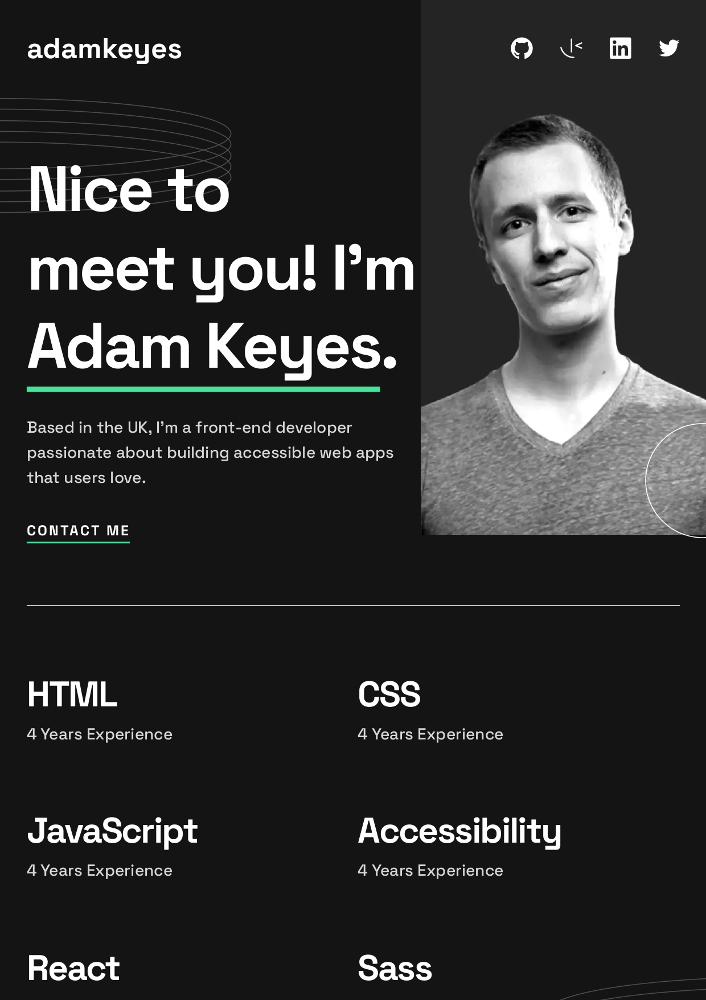

# Developer portfolio

This is my implementation of the Single-page developer portfolio.

## Table of contents

- [Overview](#overview)
  - [The project](#the-project)
  - [Screenshot](#screenshot)
- [My process](#my-process)
  - [Built with](#built-with)
  - [What I learned](#what-i-learned)
  - [Useful resources](#useful-resources)
- [Author](#author)

## Overview

### The project

Users should be able to:

- Receive an error message when the `form` is submitted if:
  - Any field is empty
  - The email address is not formatted correctly
- View the optimal layout for the interface depending on their device's screen size
- See hover states for all interactive elements on the page
- When the user clicks the `Contact me` in the hero or projects section, the browser should scroll down to the contact form.

### Screenshot



## My process

### Built with

- [React](https://reactjs.org/) - JS library
- [Next.js](https://nextjs.org/) - React framework
- [Styled Components](https://styled-components.com/) - For styles
- CSS Flexbox
- CSS Grid
- useRef hook

### What I learned

I switched to styled-components for styling in the Next.js project just to make sure I get myself acquainted with CSS-in-JS registry configuration in Next.js 14+ and createGlobalStyle API of styled-components.

```js
'use client';

import React, { useState } from 'react';
import { useServerInsertedHTML } from 'next/navigation';
import {
  ServerStyleSheet,
  StyleSheetManager,
} from 'styled-components';

export default function StyledComponentsRegistry({ children }) {
  const [styledComponentsStyleSheet] = useState(
    () => new ServerStyleSheet()
  );

  useServerInsertedHTML(() => {
    const styles = styledComponentsStyleSheet.getStyleElement();
    styledComponentsStyleSheet.instance.clearTag();
    return <>{styles}</>;
  });

  if (typeof window !== 'undefined') return <>{children}</>;

  return (
    <StyleSheetManager sheet={styledComponentsStyleSheet.instance}>
      {children}
    </StyleSheetManager>
  );
}
```

### Useful resources

- [Injecting a Line Break](https://css-tricks.com/injecting-line-break/) - This helped me for implementing the injecting of a line break.

## Author

- Website - [Jett Zhang](https://github.com/seamissu)
